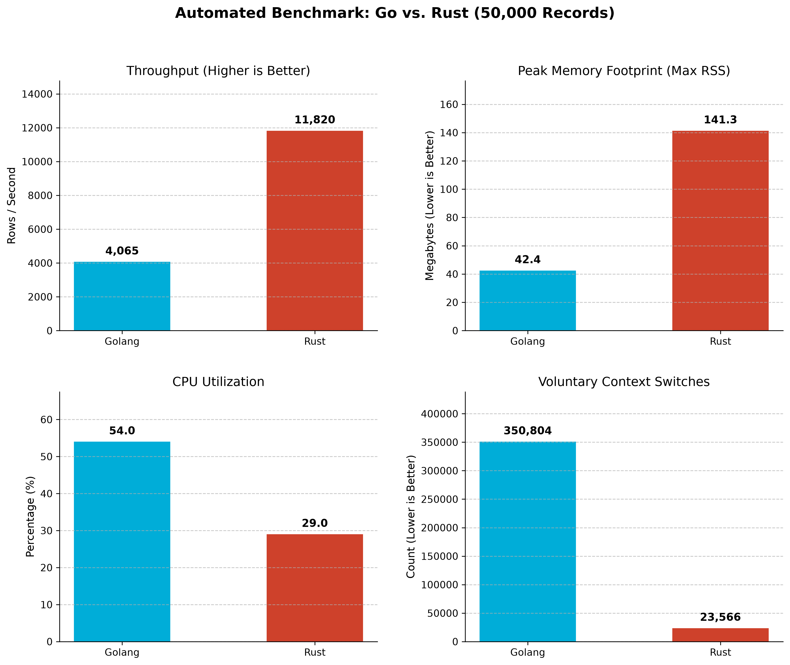

# High-Throughput Distributed Data Ingestion Engine

An experimental distributed streaming pipeline built to benchmark and analyze the architectural and OS-level trade-offs between **Golang** and **Rust** in high-performance data infrastructure.

Designed by Priyantar Jonak, this project simulates a real-world, high-throughput ingestion gateway processing complex transaction payloads via gRPC, buffering them through Apache Kafka, and executing highly parallelized bulk inserts into PostgreSQL.

## 🏗️ System Architecture

The pipeline consists of decoupled microservices and an automated CI-style benchmarking suite running inside a Dockerized ecosystem:

1. **gRPC Data Generator (Go):** A high-throughput client streaming 50,000 heavily nested, mock transaction payloads over TCP.
2. **Ingestion Gateway (Go):** An asynchronous gRPC server that receives the raw protobuf streams, marshals them into universally consumable JSON, and acts as a non-blocking Kafka Producer.
3. **Consumer Worker Pools (Go vs. Rust):** Subscribes to the Kafka topic using a Fan-Out pattern. A main thread pushes raw byte slices into an MPMC (Multi-Producer, Multi-Consumer) channel, allowing worker threads mapped to hardware CPU cores to parallelize CPU-bound JSON parsing and execute `1,000`-record batched `INSERT` statements with `ON CONFLICT DO NOTHING` idempotency.
4. **Automated Orchestrator (Bash & Python):** A custom shell script that safely manages background Unix processes, polls database states, dynamically captures OS-level metrics via `/usr/bin/time`, and feeds the data into a Matplotlib pipeline for automated visual analysis.

## ⚙️ Technology Stack

* **Languages:** Golang (1.21+), Rust (Edition 2021), Python 3
* **Message Broker:** Apache Kafka (KRaft mode)
* **Database:** PostgreSQL 15 (with `sqlx` and `lib/pq` drivers)
* **RPC & Serialization:** gRPC, Protocol Buffers (`protoc`)
* **Infrastructure & Tooling:** Docker, Docker Compose, GNU `time`, Bash
* **Visualization:** Matplotlib, Numpy

## 📊 Benchmark Results: Go vs. Rust (50,000 Records)



**Methodology:** 50,000 heavily nested JSON transaction payloads were streamed through the gRPC gateway into Kafka. Both consumers were compiled into highly optimized release binaries and profiled using Linux `/usr/bin/time -v` on a multi-core system to capture total execution time, CPU load, and kernel-level paging/context switching.

| Metric | Golang Consumer | Rust Consumer |
| :--- | :--- | :--- |
| **Throughput (TPS)** | 3,008 rows/sec | **11,682 rows/sec** |
| **Total Execution Time** | 16.62 Seconds | **4.28 Seconds** |
| **CPU Utilization** | 46.0% | **34.0%** |
| **Peak Memory (Max RSS)** | **48.2 MB** | 138.9 MB |
| **Voluntary Context Switches** | 366,180 | **20,119** |

### 🔍 Architectural & OS-Level Observations

* **Asynchronous Speed vs. Context Switching:** Rust’s `tokio` runtime utilizes a state-machine-based event loop (epoll) to park tasks in user-space, resulting in a staggering **3.8x faster throughput**. Go's goroutine scheduler, while highly ergonomic, aggressively swapped contexts across OS threads during network I/O, resulting in **18x more voluntary context switches** (366,180 vs 20,119) and higher overall CPU utilization.
* **The Memory Trade-Off (The Baseline Cost):** Interestingly, Go maintained a significantly lower peak memory footprint during this 50k burst test. Go's Garbage Collector aggressively freed short-lived JSON structs on the fly. Conversely, Rust's utilization of pre-allocated vectors (`Vec::with_capacity`), MPMC channels, and the `librdkafka` C-bindings established a higher static memory baseline, trading a slightly larger initial footprint for unparalleled execution speed.

## 🚀 How to Run Locally

### 1. Spin up the Infrastructure
```bash
docker-compose up -d

cd gateway-service
go run main.go

chmod +x run_benchmark.sh
./run_benchmark.sh
```

**Open Source. Built for exploration and distributed system benchmarking.# High-Throughput-Ingestion-Engine-in-Go-Rust**
